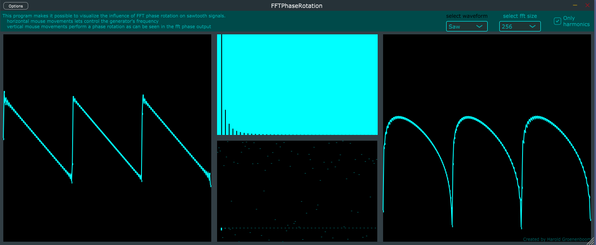

# Phase Rotation Experiment

This project explores the manipulation of FFT phase for phase rotation in audio signals.

Currently, phase rotation can be inspected using:
- Sinewaves
- Noise
- Squarewaves
- Sawtoothwaves
- Mixtures of the above.

This project uses JUCE to facilitate easy audio signal manipulation. This project is written as a quick side project, so minimal attention has been given to extensibility and performance. You can find application binaries in the `Builds` folder if you don't want to build yourself.

## Features
- Waveform selection
- FFT size selection
- Visual feedback in both time and frequency domains

## Purpose
The primary goal is to develop a better understanding of the relationships between phase, magnitude, and time domain signals. This software aims to provide simple and intuitive insights into how the frequency domain and time domain influence each other. Main areas of interest:
- Time domain transients and frequency domain phase
- Non-circular (frequencies between bins) FFT input and frequency response

## Potential Future Features
- Waveform, phase, and magnitude editing
- Real-imaginary plot
